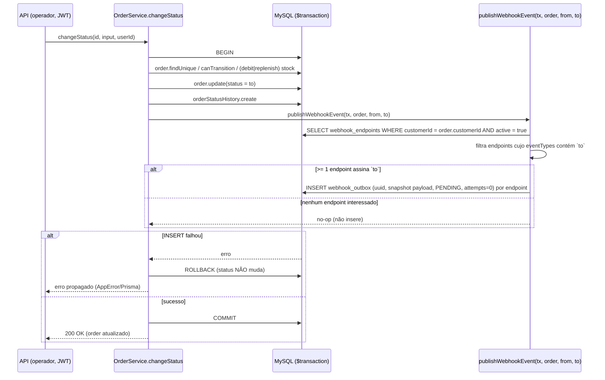
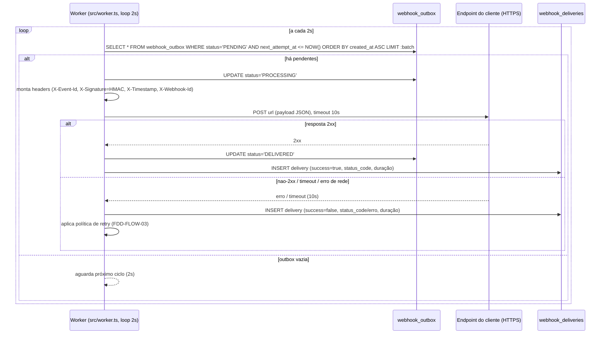
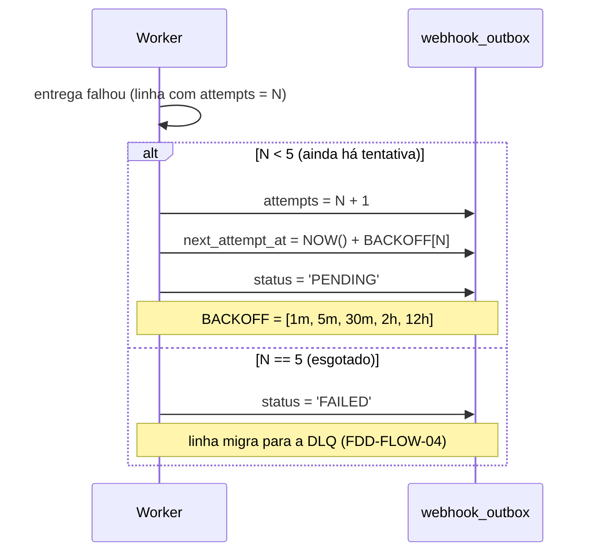
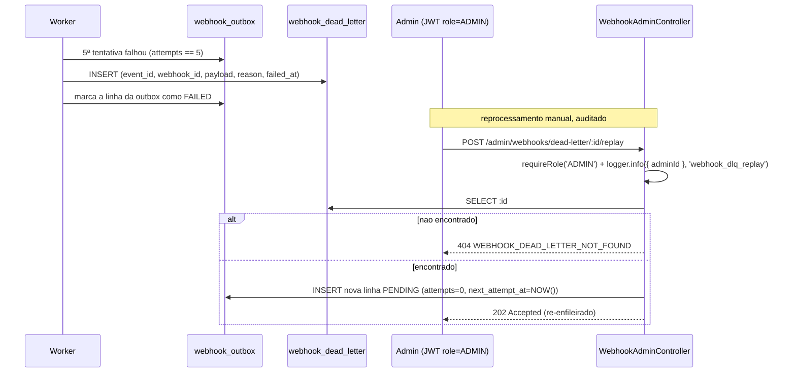

# FDD — Feature Design Document
## Sistema de Webhooks de Notificação de Pedidos

| | |
|---|---|
| **Autor** | Gabriele Rocha |
| **Data de elaboração** | 15 de julho de 2026 |
| **Revisores / decisores** | Larissa (Tech Lead), Marcos (PM), Bruno (Eng. Pleno – Pedidos), Diego (Eng. Sênior – Plataforma), Sofia (Eng. de Segurança) |
| **Altitude** | Implementação — responde *"COMO construir, em detalhe"* |
| **Stack** | Node.js + TypeScript + Express + Prisma + MySQL (produção) |
| **Documentos irmãos** | PRD (produto), RFC (arquitetura/alternativas), ADR-001..008 (decisões) |

> **Nota de altitude.** Este é o documento mais profundo do pacote. O *porquê* de cada decisão vive nos ADRs; o *o quê* de produto (RFs, NFRs, métricas, fora-de-escopo) vive no PRD; as alternativas descartadas vivem no RFC. Aqui detalhamos **como** implementar, integrando ao código já em produção. Onde um assunto pertence a outro documento, apenas o **referenciamos**.

---

## 1. Contexto e motivação técnica

Três clientes B2B — Atlas Comercial, MaxDistribuição e Nova Cargo — pediram formalmente para serem notificados em tempo real quando o status dos pedidos deles muda; hoje fazem *polling* caro batendo em `GET /orders` de tempos em tempos [09:00] Marcos. "Tempo real", para eles, é qualquer coisa **abaixo de 10 segundos** [09:02] Marcos. O escopo é estritamente **outbound** (nós → cliente); o cliente recebe, não envia [09:02] Marcos, [09:03] Sofia. O detalhamento de produto está no PRD.

Do ponto de vista técnico, o desafio central é acoplar a emissão do evento à mudança de status do pedido **sem** introduzir uma chamada HTTP dentro da transação de negócio. A transação atual de `changeStatus` já é pesada — atualiza `orders`, insere em `order_status_history` e movimenta estoque — e um HTTP síncrono no meio dela travaria a mudança de status de outros pedidos e forçaria *rollback* caso o cliente estivesse fora do ar [09:04] Bruno. Isso está confirmado no código: `changeStatus` roda inteiramente dentro de `this.prisma.$transaction` (`src/modules/orders/order.service.ts`, L126-179).

A decisão fechada foi o **padrão Outbox no MySQL** [09:06] Diego, [09:08] Larissa (ADR-001): dentro da mesma transação SQL que muda o status, inserimos uma linha em `webhook_outbox`; um **worker separado** faz *polling* e dispara o HTTP (ADR-002). Se a transação commitou, o evento existe; se deu *rollback*, o evento some junto — sem inconsistência possível [09:06] Diego. Preferiu-se o outbox no MySQL existente a subir fila externa (Redis) por ser um time pequeno e isso ser *overengineering* [09:07] Larissa/Diego (trade-off detalhado no RFC).

---

## 2. Objetivos técnicos

| ID | Objetivo técnico | Origem |
|----|------------------|--------|
| FDD-OBJ-01 | Emitir o evento de forma **atômica** com a mudança de status: inserção na outbox dentro da `$transaction`; falha na inserção ⇒ *rollback* (status não muda sem evento) | [09:40] Bruno, [09:41] Diego |
| FDD-OBJ-02 | Entregar o evento em **< 10s** no caminho feliz; *polling* de 2s ⇒ latência mínima de 2s no pior caso, aceita | [09:02] Marcos, [09:10] Larissa/Marcos |
| FDD-OBJ-03 | Rodar o processamento em **processo separado** da API, resiliente a *restart* da API | [09:11] Diego |
| FDD-OBJ-04 | Garantir **at-least-once** com `X-Event-Id` para dedup do lado do cliente | [09:24]-[09:26] Diego |
| FDD-OBJ-05 | Tolerar indisponibilidade do cliente via **retry com backoff** (5 tentativas, ~15h) e **DLQ** persistida com *replay* manual | [09:15]-[09:18] Diego |
| FDD-OBJ-06 | Assinar cada envio com **HMAC-SHA256** (secret por endpoint, rotação com grace de 24h) | [09:20]-[09:22] Sofia |
| FDD-OBJ-07 | **Reusar ao máximo** os padrões existentes: `AppError`, Pino, error middleware, padrão de módulos, schemas Zod, códigos de erro com prefixo `WEBHOOK_` | [09:27]-[09:30] Bruno/Larissa |

---

## 3. Escopo e exclusões

### 3.1 Dentro do escopo (implementação)
- Módulo `src/modules/webhooks` (controller/service/repository/routes/schemas) espelhando os módulos existentes [09:27] Bruno.
- Novos models Prisma para outbox, endpoints, deliveries e dead-letter (ver §12.2).
- Novo entry-point `src/worker.ts` + script `npm run worker`, análogo a `src/server.ts` [09:11] Larissa.
- Integração no `changeStatus` via função pura `publishWebhookEvent(tx, order, fromStatus, toStatus)` [09:41] Bruno/Diego.
- CRUD de configuração de webhook, rotação de secret, histórico de entregas e *replay* de DLQ (endpoints em §5).

### 3.2 Fora do escopo / adiados
São itens **explicitamente descartados ou adiados na reunião** — não podem reaparecer como requisito. Detalhamento no PRD (Fora de escopo) e no RFC (Questões em aberto).

| Item | Status | Origem |
|------|--------|--------|
| E-mail de aviso ao cliente quando o webhook falha | Adiado — próxima fase, após medir impacto | [09:37] Larissa, [09:38] Marcos |
| Rate limiting de saída | Em aberto — "observar e decidir depois" | [09:38]-[09:39] Diego/Larissa |
| Dashboard/painel visual para o cliente | Fora de escopo — projeto do time de frontend | [09:39] Marcos, [09:40] Larissa |
| Múltiplos workers em paralelo (partição por `order_id`, lock pessimista) | Futuro — "problema do futuro" | [09:13] Diego |
| Webhooks inbound (cliente → nós) | Fora de escopo — só outbound | [09:02] Marcos/Sofia |
| Arquivamento de linhas entregues da outbox (~30 dias) | Fora do escopo desta feature | [09:08] Diego |
| Endurecimento de roles do CRUD de config | Futuro — CRUD fica com qualquer role autenticada por ora | [09:37] Sofia |
| Exactly-once delivery | Descartado — coordenação complexa; at-least-once resolve | [09:25] Diego |

---

## 4. Fluxos detalhados

### 4.1 FDD-FLOW-01 — Criação do evento na outbox dentro da transação de `changeStatus`

A inserção na outbox entra na mesma `$transaction` que já muda o status, **após** `tx.orderStatusHistory.create` (`src/modules/orders/order.service.ts`, L159-167). A filtragem por assinatura acontece **na inserção** (ADR-008): se nenhum endpoint do customer ouve o status de destino, não insere nada — economiza linha [09:34] Bruno/Diego. O payload é gravado **já renderizado** (snapshot, ADR-007) [09:52] Larissa/Diego/Bruno. Se a inserção falhar, a transação inteira faz *rollback* e o status **não muda** [09:40] Bruno, [09:41] Diego.



### 4.2 FDD-FLOW-02 — Processamento pelo worker (polling 2s, batch de pendentes por `created_at`)

O worker roda em processo separado (`src/worker.ts`) e, **a cada 2 segundos**, busca os eventos pendentes mais antigos, processa e marca [09:09] Diego, [09:10] Larissa. A ordenação é por `created_at` — ordering implícita **por `order_id`** enquanto for single-worker, **não** global (limitação conhecida documentada) [09:12] Diego, [09:13] Larissa, [09:14] Marcos. O timeout do HTTP call é de **10 segundos**; não respondeu ⇒ falha ⇒ retry [09:42] Diego.



### 4.3 FDD-FLOW-03 — Retry com backoff exponencial (`next_attempt_at`, 5 tentativas)

Cliente offline ⇒ **backoff exponencial**; após o teto de tentativas ⇒ DLQ (ADR-003) [09:15] Diego. São **5 tentativas** com backoff **1m / 5m / 30m / 2h / 12h**, ~15h entre a 1ª falha e a última tentativa [09:17] Diego/Larissa. `attempts` e `next_attempt_at` vivem na própria linha da outbox; a seleção do worker só considera linhas cujo `next_attempt_at` já venceu.



> Semântica precisa do índice de backoff e do teto em §7 (Resiliência). A janela total (~15h) foi aceita por Marcos: cliente caído 15h já tem problema sério dele [09:17] Marcos.

### 4.4 FDD-FLOW-04 — DLQ (tabela separada) + replay admin

Falha permanente move o evento para `webhook_dead_letter` — **tabela separada**, com payload, motivo da falha e timestamp; mantém a leitura da outbox limpa e serve de *evidence* para debug e reprocessamento [09:18] Diego. O reprocessamento é **manual via endpoint admin** `POST /admin/webhooks/dead-letter/:id/replay`, que recoloca o evento na outbox como pendente [09:18] Diego. O endpoint exige **role ADMIN** (reaproveita `requireRole`) e **loga quem fez o replay** para auditoria [09:36] Sofia/Larissa.



---

## 5. Contratos públicos

Base: `/api/v1`. Todos os endpoints de configuração exigem `authenticate` (qualquer role autenticada por ora) [09:37] Sofia; o *replay* de DLQ exige `requireRole('ADMIN')` [09:36] Sofia/Larissa. `customer_id` **não vem do JWT** (o JWT é do operador); é passado no body/path [09:32] Bruno/Marcos/Larissa. Corpo de erro segue o formato do error middleware existente (`{ "error": { "code", "message", "details?" } }` — `src/middlewares/error.middleware.ts`).

### 5.1 FDD-CONTRATO-01 — `POST /api/v1/webhooks` (cadastrar endpoint) — [09:31][09:32]

Cadastra um endpoint; a **secret é gerada por nós e devolvida na criação** [09:31] Marcos. URL precisa ser **HTTPS** (Zod recusa `http`) [09:23] Sofia.

**Request** `Authorization: Bearer <jwt>` · `Content-Type: application/json`
```json
{
  "customerId": "3f2504e0-4f89-41d3-9a0c-0305e82c3301",
  "url": "https://hooks.atlascomercial.com/oms/orders",
  "eventTypes": ["SHIPPED", "DELIVERED"]
}
```
**Response `201 Created`** (a `secret` só aparece aqui):
```json
{
  "id": "9c5b94b1-35ad-49bb-b118-8e8fc24abf80",
  "customerId": "3f2504e0-4f89-41d3-9a0c-0305e82c3301",
  "url": "https://hooks.atlascomercial.com/oms/orders",
  "eventTypes": ["SHIPPED", "DELIVERED"],
  "active": true,
  "secret": "whsec_2b7e151628aed2a6abf7158809cf4f3c762e7160f38b4da5",
  "createdAt": "2026-07-15T13:04:22.581Z"
}
```
**Status codes:** `201` criado · `400` validação (Zod) · `422` `WEBHOOK_URL_NOT_HTTPS` / `WEBHOOK_INVALID_EVENT_TYPE` · `401` sem token. (A secret é gerada pelo servidor e devolvida na resposta — não é enviada na requisição.)

### 5.2 FDD-CONTRATO-02 — `GET /api/v1/webhooks?customerId=` (listar) — [09:33]

**Request:** `GET /api/v1/webhooks?customerId=3f2504e0-...` · `Authorization: Bearer <jwt>`
**Response `200 OK`** (secret **nunca** retorna em leitura):
```json
{
  "data": [
    {
      "id": "9c5b94b1-35ad-49bb-b118-8e8fc24abf80",
      "customerId": "3f2504e0-4f89-41d3-9a0c-0305e82c3301",
      "url": "https://hooks.atlascomercial.com/oms/orders",
      "eventTypes": ["SHIPPED", "DELIVERED"],
      "active": true,
      "createdAt": "2026-07-15T13:04:22.581Z"
    }
  ]
}
```
**Status codes:** `200` · `401` sem token.

### 5.3 FDD-CONTRATO-03 — `PATCH /api/v1/webhooks/:id` (editar) — [09:33]

Edita `url`, `eventTypes` e/ou `active`. Mesmas validações de HTTPS e event types do POST.

**Request:**
```json
{ "eventTypes": ["PAID", "PROCESSING", "SHIPPED", "DELIVERED"], "active": true }
```
**Response `200 OK`:**
```json
{
  "id": "9c5b94b1-35ad-49bb-b118-8e8fc24abf80",
  "customerId": "3f2504e0-4f89-41d3-9a0c-0305e82c3301",
  "url": "https://hooks.atlascomercial.com/oms/orders",
  "eventTypes": ["PAID", "PROCESSING", "SHIPPED", "DELIVERED"],
  "active": true,
  "updatedAt": "2026-07-15T14:10:03.114Z"
}
```
**Status codes:** `200` · `404` `WEBHOOK_NOT_FOUND` · `422` `WEBHOOK_URL_NOT_HTTPS`/`WEBHOOK_INVALID_EVENT_TYPE` · `401`.

`DELETE /api/v1/webhooks/:id` (remover) [09:33] segue o mesmo padrão: `204 No Content` · `404 WEBHOOK_NOT_FOUND`.

### 5.4 FDD-CONTRATO-04 — `POST /api/v1/webhooks/:id/secret/rotate` (rotacionar secret) — [09:21]

Gera nova secret; a **antiga fica válida por 24h em paralelo** (grace period) e depois morre [09:21] Sofia.

**Response `200 OK`:**
```json
{
  "id": "9c5b94b1-35ad-49bb-b118-8e8fc24abf80",
  "secret": "whsec_8f14e45fceea167a5a36dedd4bea2543c8b9f2d1a7e0c5b3",
  "previousSecretExpiresAt": "2026-07-16T14:20:00.000Z"
}
```
**Status codes:** `200` · `404` `WEBHOOK_NOT_FOUND` · `409` `WEBHOOK_SECRET_ROTATION_PENDING` (rotação já em grace) · `401`.

### 5.5 FDD-CONTRATO-05 — `GET /api/v1/webhooks/:id/deliveries` (histórico) — [09:34]

Últimas **100** entregas: sucesso/falha, payload, response e tempo de resposta [09:34] Marcos.

**Response `200 OK`:**
```json
{
  "data": [
    {
      "eventId": "0b1e4c2a-7d3f-4a91-9c22-77a1b2c3d4e5",
      "eventType": "order.status_changed",
      "success": true,
      "statusCode": 200,
      "durationMs": 342,
      "attempt": 1,
      "createdAt": "2026-07-15T13:30:11.900Z",
      "responseBody": "{\"received\":true}"
    },
    {
      "eventId": "1c2d5e3b-8e4a-4b02-ad33-88b2c3d4e5f6",
      "eventType": "order.status_changed",
      "success": false,
      "statusCode": 503,
      "durationMs": 10000,
      "attempt": 3,
      "createdAt": "2026-07-15T13:28:05.120Z",
      "responseBody": null
    }
  ]
}
```
**Status codes:** `200` · `404` `WEBHOOK_NOT_FOUND` · `401`.

### 5.6 FDD-CONTRATO-06 — `POST /api/v1/admin/webhooks/dead-letter/:id/replay` (ADMIN) — [09:18][09:35][09:36]

Reprocessa um item da DLQ; recoloca na outbox como pendente. **Role ADMIN obrigatória** e **auditado** [09:36] Sofia/Larissa.

**Request:** `Authorization: Bearer <jwt role=ADMIN>` · body vazio.
**Response `202 Accepted`:**
```json
{
  "deadLetterId": "aa11bb22-cc33-dd44-ee55-ff6677889900",
  "requeuedOutboxId": "b7c8d9e0-1122-3344-5566-7788990011aa",
  "status": "PENDING"
}
```
**Status codes:** `202` re-enfileirado · `404` `WEBHOOK_DEAD_LETTER_NOT_FOUND` · `403` (role != ADMIN, via `requireRole`) · `401`.

### 5.7 FDD-CONTRATO-07 — Requisição outbound entregue ao cliente — [09:43][09:44]

Este é o "contrato" que o cliente consome. O worker faz `POST` na `url` cadastrada, com o payload snapshot e os headers de rastreio/segurança.

**Headers** [09:44] Diego/Sofia:

| Header | Conteúdo | Origem |
|--------|----------|--------|
| `X-Event-Id` | UUID do evento (= `id` da outbox), único por evento; base de dedup no cliente | [09:25][09:44] Diego |
| `X-Signature` | HMAC-SHA256 do corpo do request, hex | [09:20] Sofia, [09:44] Diego |
| `X-Timestamp` | timestamp do envio (cliente pode detectar replay attack) | [09:44] Diego |
| `X-Webhook-Id` | id do endpoint (cliente com vários sabe qual cadastro caiu) | [09:44] Sofia |
| `Content-Type` | `application/json` | [09:44] Diego |

**Body** (`event_type` ex. `"order.status_changed"`, `timestamp` ISO 8601; **sem** `items` — cliente busca detalhe em `GET /orders/:id` depois) [09:43] Diego:
```json
{
  "event_id": "0b1e4c2a-7d3f-4a91-9c22-77a1b2c3d4e5",
  "event_type": "order.status_changed",
  "timestamp": "2026-07-15T13:30:11.558Z",
  "order_id": "5d41402a-bc4b-2a76-b971-9d911017c592",
  "order_number": "ORD-000512",
  "from_status": "PROCESSING",
  "to_status": "SHIPPED",
  "customer_id": "3f2504e0-4f89-41d3-9a0c-0305e82c3301",
  "total_cents": 149900
}
```
> Nomes dos campos da order derivam de `prisma/schema.prisma` (`orderNumber`, `totalCents`, `status`, `customerId`). Sucesso = qualquer `2xx` do cliente; qualquer outra coisa (ou timeout de 10s) ⇒ falha ⇒ retry.

---

## 6. Matriz de erros previstos (`WEBHOOK_*`)

Todos herdam de `AppError(message, statusCode, errorCode, details)` (`src/shared/errors/app-error.ts`) e usam prefixo `WEBHOOK_`, exatamente como `InvalidStatusTransitionError`/`InsufficientStockError` fazem hoje [09:28] Bruno, [09:29] Larissa. O error middleware os serializa sem alteração (§12, FDD-INT-03).

| ID | Código | HTTP | Quando ocorre | Origem da regra |
|----|--------|------|---------------|-----------------|
| FDD-ERR-01 | `WEBHOOK_NOT_FOUND` | 404 | Endpoint inexistente em GET/PATCH/DELETE/rotate/deliveries | [09:28] Bruno (exemplo) |
| FDD-ERR-02 | `WEBHOOK_INVALID_URL` | 422 | URL malformada na criação/edição | [09:28] Bruno (exemplo) |
| FDD-ERR-03 | `WEBHOOK_URL_NOT_HTTPS` | 422 | URL não é `https` (TLS obrigatório) | [09:23] Sofia |
| FDD-ERR-04 | `WEBHOOK_SECRET_REQUIRED` | 400 | Fluxo que exige secret sem ela presente | [09:28] Bruno (exemplo) |
| FDD-ERR-05 | `WEBHOOK_PAYLOAD_TOO_LARGE` | 422 | Payload renderizado ultrapassa 64KB (erra, não trunca) | [09:23][09:24] Sofia/Diego/Larissa |
| FDD-ERR-06 | `WEBHOOK_INVALID_EVENT_TYPE` | 422 | `eventTypes` contém valor fora do enum `OrderStatus` | [09:33] Marcos/Bruno |
| FDD-ERR-07 | `WEBHOOK_DEAD_LETTER_NOT_FOUND` | 404 | Replay de id inexistente na DLQ | [09:18] Diego |
| FDD-ERR-08 | `WEBHOOK_SECRET_ROTATION_PENDING` | 409 | Rotação solicitada com grace period da anterior ainda ativo | [09:21] Sofia |
| FDD-ERR-09 | `WEBHOOK_DELIVERY_TIMEOUT` | (interno, worker) | Cliente não respondeu em 10s | [09:42] Diego |

> `WEBHOOK_DELIVERY_TIMEOUT` é erro **interno do worker** (dispara retry/registro em `webhook_deliveries`), não um HTTP status de API pública.

---

## 7. Estratégias de resiliência

| ID | Estratégia | Detalhe de implementação | Origem |
|----|-----------|--------------------------|--------|
| FDD-RES-01 | **Atomicidade** | Inserção na outbox dentro da `$transaction` de `changeStatus`; falha ⇒ *rollback* total; status não muda sem evento | [09:40] Bruno, [09:41] Diego |
| FDD-RES-02 | **Timeout de 10s** | HTTP client do worker aborta a chamada em 10s; ⇒ falha ⇒ retry | [09:42] Diego |
| FDD-RES-03 | **Retry com backoff** | 5 tentativas, backoff `1m/5m/30m/2h/12h`, ~15h de janela; `next_attempt_at` na linha da outbox | [09:15]-[09:17] Diego/Larissa |
| FDD-RES-04 | **DLQ + replay** | `webhook_dead_letter` separada; replay ADMIN auditado recoloca na outbox | [09:18][09:36] Diego/Sofia |
| FDD-RES-05 | **Worker resiliente a restart da API** | Processo separado (`src/worker.ts`), `PrismaClient` próprio; API pode reiniciar sem perder o worker | [09:11] Diego |
| FDD-RES-06 | **At-least-once** | `X-Event-Id` por evento; dedup delegada ao cliente | [09:24]-[09:26] Diego |

**Algoritmo de backoff (referência de implementação).** `attempts` inicia em `0` na inserção. O worker só considera linhas `status='PENDING' AND next_attempt_at <= NOW()`. Ao falhar uma entrega de uma linha com `attempts = N`:

```
MAX_ATTEMPTS = 5
BACKOFF = [60_000, 300_000, 1_800_000, 7_200_000, 43_200_000]  // 1m, 5m, 30m, 2h, 12h (ms)

on failure(row):
  N = row.attempts
  if (N < MAX_ATTEMPTS) {                       // ainda há tentativa
    row.attempts        = N + 1
    row.next_attempt_at = now() + BACKOFF[N]     // N=0 -> 1m, 1 -> 5m, 2 -> 30m, 3 -> 2h, 4 -> 12h
    row.status          = 'PENDING'
  } else {                                       // N === 5: esgotou as 5 tentativas
    row.status          = 'FAILED'
    move(row -> webhook_dead_letter)             // FDD-FLOW-04
  }
```

Retry indefinido e 3 tentativas foram **descartados** na reunião (indefinido pendura evento para sempre; 3 mata cedo demais frente a indisponibilidade de 2h) — trade-offs no RFC [09:15]-[09:16] Diego.

---

## 8. Observabilidade

Sem stack nova: reaproveita o **Pino** já configurado em todo o projeto, com `redact` de credenciais (`src/shared/logger/index.ts`) [09:29] Bruno. Não há decisão de reunião por métricas/tracing dedicados; o que segue é a **proposta de implementação** sobre a infraestrutura existente.

### 8.1 Logs (Pino) — FDD-OBS-01
Usar o `logger` exportado por `src/shared/logger/index.ts`, tanto na API quanto no worker. Eventos de log propostos, com campos estruturados e chaves no mesmo estilo do projeto (`server_started`, `shutdown_initiated`):

| Evento de log | Nível | Campos-chave |
|---------------|-------|--------------|
| `webhook_outbox_enqueued` | info | `event_id`, `webhook_id`, `order_id`, `to_status` |
| `webhook_delivery_attempt` | info | `event_id`, `webhook_id`, `attempt`, `status_code`, `duration_ms` |
| `webhook_delivery_failed` | warn | `event_id`, `webhook_id`, `attempt`, `error`, `next_attempt_at` |
| `webhook_dead_lettered` | error | `event_id`, `webhook_id`, `reason`, `attempts` |
| `webhook_dlq_replay` | info | `dead_letter_id`, `admin_id` (auditoria do replay) [09:36] Sofia |

> O `redact` existente já protege `authorization`, `token`, `password*`. A **secret** e o header `X-Signature` **não** devem ser logados; incluir seus caminhos no `redact` ao implementar (motivação: já houve cliente que vazou secret em log [09:22] Diego).

### 8.2 Métricas — FDD-OBS-02
Derivar métricas dos dados já persistidos (não exige serviço novo): profundidade da outbox (`count status='PENDING'`), taxa de sucesso/falha e latência por `webhook_deliveries` (`duration_ms`), e volume da DLQ. Podem ser expostas por contadores/logs agregáveis no worker; instrumentação dedicada fica como evolução (fora do que foi decidido em reunião).

### 8.3 Tracing — FDD-OBS-03
O `X-Event-Id` funciona como **correlation id** ponta a ponta: nasce na inserção da outbox (FDD-FLOW-01), viaja no header do envio (FDD-CONTRATO-07) e aparece em todo log de entrega e na `webhook_deliveries`, permitindo rastrear um evento da transação de status até a resposta do cliente. Reaproveita também o `requestId` do `request-logger` existente na camada de API.

---

## 9. Dependências e compatibilidade

| Dependência | Situação | Origem |
|-------------|----------|--------|
| MySQL via Prisma (mesma `DATABASE_URL`) | Reuso; worker abre `PrismaClient` próprio (por processo) | [09:11][09:30] Bruno/Diego |
| `createPrismaClient()` (`src/config/database.ts`) | Reuso no `src/worker.ts` | CODIGO |
| Express + middlewares (`authenticate`, `requireRole`, `validate`, `errorMiddleware`) | Reuso sem alteração | [09:29][09:36] |
| Pino (`src/shared/logger/index.ts`) | Reuso | [09:29] Bruno |
| Enum `OrderStatus` (`prisma/schema.prisma`) | Fonte de verdade dos `eventTypes` válidos | CODIGO |
| Cliente HTTP para o worker (com timeout de 10s) | Nova dependência de saída; TLS obrigatório nos endpoints | [09:23][09:42] |
| Vitest (`tests/*.test.ts`, `tests/helpers/factories.ts`) | Reuso para os testes do módulo | CODIGO |
| Revisão de segurança da Sofia (HMAC + geração de secret), ≥2 dias úteis antes do deploy | Bloqueio de release | [09:46] Sofia |

Compatibilidade: **nenhuma quebra** de contrato existente. `changeStatus` mantém a mesma assinatura pública; a única mudança é uma chamada adicional **dentro** da transação. Novos models são aditivos ao schema. Prazo: 3 sprints incluindo a revisão da Sofia [09:46] Larissa.

---

## 10. Critérios de aceite técnicos

| ID | Critério | Verificação | Origem |
|----|----------|-------------|--------|
| FDD-AC-01 | Mudar status insere linha na outbox **na mesma transação**; se a inserção falha, o status **não muda** (rollback) | Teste de integração transação→outbox | [09:40][09:41] |
| FDD-AC-02 | Nenhuma linha é inserida se nenhum endpoint do customer ouve o status de destino | Teste de filtragem na inserção | [09:34] |
| FDD-AC-03 | Payload é gravado como **snapshot** na inserção; alterar o pedido depois não muda o evento | Teste unit de `publishWebhookEvent` | [09:52] |
| FDD-AC-04 | Worker entrega em **< 10s** no caminho feliz (polling 2s) | Teste de integração worker→delivery | [09:02][09:10] |
| FDD-AC-05 | Falha de entrega agenda retry com backoff `1m/5m/30m/2h/12h`; após a 5ª, vai para a DLQ | Teste unit de backoff + DLQ | [09:15]-[09:18] |
| FDD-AC-06 | Cada envio leva headers `X-Event-Id`, `X-Signature` (HMAC-SHA256), `X-Timestamp`, `X-Webhook-Id`, `Content-Type` | Teste do montador de request | [09:44] |
| FDD-AC-07 | Rotação gera nova secret e mantém a anterior válida por **24h** | Teste de rotação/grace | [09:21] |
| FDD-AC-08 | URL não-`https` é recusada na criação/edição (`WEBHOOK_URL_NOT_HTTPS`) | Teste e2e do schema Zod | [09:23] |
| FDD-AC-09 | Payload > 64KB é recusado (erra, não trunca) | Teste unit | [09:23][09:24] |
| FDD-AC-10 | Replay de DLQ exige role **ADMIN** e loga quem executou | Teste e2e `requireRole` + log de auditoria | [09:36] |
| FDD-AC-11 | `X-Event-Id` é UUID único por evento; reentrega usa o mesmo id (at-least-once) | Teste de entrega/reentrega | [09:24]-[09:26] |
| FDD-AC-12 | Worker roda como processo separado e sobrevive a restart da API | Teste operacional | [09:11] |

---

## 11. Riscos e mitigação

Riscos de produto/negócio estão no PRD; abaixo o recorte **de implementação** e como o design os endereça.

| ID | Risco (técnico) | Mitigação no design | Origem |
|----|-----------------|---------------------|--------|
| FDD-RISK-01 | Cliente offline por período longo perde eventos | Backoff 5 tentativas ~15h + DLQ + replay manual | [09:15]-[09:18] |
| FDD-RISK-02 | Secret vazada (ex.: log do cliente) | Secret por endpoint + rotação com grace 24h; `redact` de secret/`X-Signature` nos logs | [09:21][09:22] |
| FDD-RISK-03 | Ordenação fora de ordem se escalar workers | Single-worker + ordering por `created_at`/`order_id`; limitação documentada; ordering global fora de escopo | [09:12]-[09:14] |
| FDD-RISK-04 | Bombardeio do cliente sem rate limit de saída | Ponto em aberto: observar e implementar se virar problema (não bloqueia esta fase) | [09:38][09:39] |
| FDD-RISK-05 | Cliente lento trava o processamento | Timeout de 10s + processamento assíncrono fora da transação | [09:42] |
| FDD-RISK-06 | Inconsistência status ↔ evento | Atomicidade via `$transaction`; rollback se a inserção falhar | [09:40][09:41] |

---

## 12. Integração com o sistema existente

Todos os caminhos abaixo são **arquivos reais** já em produção. A feature integra por **extensão mínima** e **reuso**, sem reescrever nada [09:30] Larissa.

### 12.1 Pontos de integração no código

| ID | Arquivo real | Como integra |
|----|--------------|--------------|
| **FDD-INT-01** | `src/modules/orders/order.service.ts` (`changeStatus`, L126-179) | Após `tx.orderStatusHistory.create` (L159-167), chamar `publishWebhookEvent(tx, order, from, to)` **dentro** do `this.prisma.$transaction` existente. `from`/`to` já estão em escopo (L138-139); reusa o `tx` (`Prisma.TransactionClient`). Se a inserção falhar, o `$transaction` inteiro faz *rollback* e o status não muda [09:40][09:41]. |
| **FDD-INT-02** | `src/shared/errors/http-errors.ts` + `src/shared/errors/app-error.ts` | Criar `WebhookError` e subclasses estendendo `AppError`/`UnprocessableEntityError`/`NotFoundError`/`ConflictError`, com códigos `WEBHOOK_*` (§6), no mesmo molde de `InvalidStatusTransitionError` (estende `ConflictError`) e `InsufficientStockError` (estende `UnprocessableEntityError`) [09:28] Bruno. |
| **FDD-INT-03** | `src/middlewares/error.middleware.ts` | **Sem alteração.** Já trata `AppError` (serializa `statusCode`/`errorCode`/`details`), `ZodError` e `Prisma`; captura os `WEBHOOK_*` automaticamente por herdarem de `AppError` [09:29] Bruno. |
| **FDD-INT-04** | `src/server.ts` + `src/config/database.ts` | Novo entry-point `src/worker.ts` espelhando o `bootstrap`/shutdown de `server.ts`, com `PrismaClient` próprio via `createPrismaClient()` (processo separado, mesma `DATABASE_URL`). Script `npm run worker` [09:11][09:30]. |
| **FDD-INT-05** | `src/middlewares/auth.middleware.ts` (`authenticate`, `requireRole`) | Reusar `authenticate` no CRUD (qualquer role autenticada por ora [09:37]) e `requireRole('ADMIN')` no replay de DLQ [09:36]. `AuthUser.role` já é `'ADMIN' \| 'OPERATOR'`. |
| **FDD-INT-06** | `src/modules/webhooks/*` (novo, molde em `src/modules/customers`) | Novo módulo com `webhook.controller.ts`, `webhook.service.ts`, `webhook.repository.ts`, `webhook.routes.ts`, `webhook.schemas.ts` espelhando `customer.*`; router construído como `buildCustomerRouter` (aplica `authenticate` + `validate`). Registrar em `src/routes/index.ts` (onde ficam o tipo `Controllers` e `buildApiRouter` — adicionar `router.use('/webhooks', ...)`) e em `src/app.ts` (`buildControllers`, que instancia os controllers e injeta o `PrismaClient`). |
| **FDD-INT-07** | `src/shared/logger/index.ts` (Pino) | Worker e módulo importam o `logger` existente; sem stack nova [09:29]. Adicionar caminhos de `secret`/`x-signature` ao `redact`. |
| **FDD-INT-08** | `prisma/schema.prisma` | Novos models `WebhookEndpoint`, `WebhookOutbox`, `WebhookDelivery`, `WebhookDeadLetter` seguindo as convenções do schema (§12.2). |

**Assinatura da função de integração** (função pura recebendo o `tx`, não injeta repository inteiro) [09:41] Bruno/Diego:
```ts
// src/modules/webhooks/webhook.publisher.ts (proposta)
async function publishWebhookEvent(
  tx: Prisma.TransactionClient,
  order: { id: string; orderNumber: string; customerId: string; totalCents: number },
  fromStatus: OrderStatus | null,
  toStatus: OrderStatus,
): Promise<void>
```

### 12.2 Proposta de modelo de dados

> **Propostas de implementação**, derivadas das decisões (§12 da fact-base), seguindo as convenções do schema atual: id `uuid @db.Char(36)`, `@@map`, `@default(now())`/`@updatedAt`, índices explícitos. Id da outbox é **UUID** [09:51] Larissa. Nomes de tabela/coluna não são citações literais.

**`webhook_endpoints`** — url (https), estado ativo, event types e a secret (com colunas de rotação/grace, já que a secret vive em coluna própria por causa da rotação [09:21] Sofia):
```prisma
model WebhookEndpoint {
  id                    String    @id @default(uuid()) @db.Char(36)
  customerId            String    @db.Char(36)
  url                   String    @db.VarChar(500)   // validado https no Zod
  eventTypes            Json                          // lista de OrderStatus
  active                Boolean   @default(true)
  secretActive          String    @db.VarChar(255)
  secretPrevious        String?   @db.VarChar(255)   // válida durante o grace
  secretPreviousExpires DateTime?                     // grace de 24h
  createdAt             DateTime  @default(now())
  updatedAt             DateTime  @updatedAt

  customer   Customer          @relation(fields: [customerId], references: [id])
  outbox     WebhookOutbox[]
  deliveries WebhookDelivery[]

  @@index([customerId])
  @@index([active])
  @@map("webhook_endpoints")
}
```

**`webhook_outbox`** — id = `X-Event-Id`; snapshot do payload; máquina de estados e agendamento de retry:
```prisma
enum WebhookOutboxStatus {
  PENDING
  PROCESSING
  FAILED
  DELIVERED
}

model WebhookOutbox {
  id                String              @id @default(uuid()) @db.Char(36)  // = X-Event-Id
  webhookEndpointId String              @db.Char(36)
  status            WebhookOutboxStatus @default(PENDING)
  payload           Json                                                   // snapshot renderizado
  attempts          Int                 @default(0)
  nextAttemptAt     DateTime            @default(now())
  createdAt         DateTime            @default(now())

  endpoint WebhookEndpoint @relation(fields: [webhookEndpointId], references: [id])

  @@index([status])
  @@index([createdAt])
  @@index([status, nextAttemptAt])      // seleção do worker
  @@map("webhook_outbox")
}
```

**`webhook_deliveries`** — histórico (últimos 100 por endpoint) com status, response, duração:
```prisma
model WebhookDelivery {
  id                String   @id @default(uuid()) @db.Char(36)
  webhookEndpointId String   @db.Char(36)
  eventId           String   @db.Char(36)      // id da outbox / X-Event-Id
  attempt           Int
  success           Boolean
  statusCode        Int?
  responseBody      String?  @db.Text
  durationMs        Int
  createdAt         DateTime @default(now())

  endpoint WebhookEndpoint @relation(fields: [webhookEndpointId], references: [id])

  @@index([webhookEndpointId, createdAt])
  @@map("webhook_deliveries")
}
```

**`webhook_dead_letter`** — payload, motivo da falha e timestamp (tabela separada da outbox) [09:18] Diego:
```prisma
model WebhookDeadLetter {
  id                String   @id @default(uuid()) @db.Char(36)
  webhookEndpointId String   @db.Char(36)
  eventId           String   @db.Char(36)      // id original da outbox
  payload           Json
  reason            String   @db.VarChar(500)
  attempts          Int
  createdAt         DateTime @default(now())

  @@index([webhookEndpointId])
  @@index([createdAt])
  @@map("webhook_dead_letter")
}
```

**Rotação de secret.** `secretActive` guarda a vigente; ao rotacionar, a atual desce para `secretPrevious` com `secretPreviousExpires = now() + 24h`; ambas são aceitas na verificação por 24h; expirada, `secretPrevious`/`secretPreviousExpires` viram `null` [09:21] Sofia. Motivação: já houve cliente que vazou secret em log [09:22] Diego. A geração de secret e o HMAC entram na revisão de segurança da Sofia antes do deploy [09:46].

---

### Referências cruzadas
- **PRD** — RFs (`PRD-FR-01..12`), NFRs, objetivos/métricas, fora de escopo, riscos de negócio.
- **RFC** — alternativas descartadas (síncrono, Redis Streams, trigger de banco, exactly-once, secret global) e questões em aberto.
- **ADR-001..008** — decisões: Outbox no MySQL, worker/polling, retry+DLQ, HMAC-SHA256, at-least-once, reuso de padrões, snapshot na outbox, filtragem na inserção.
