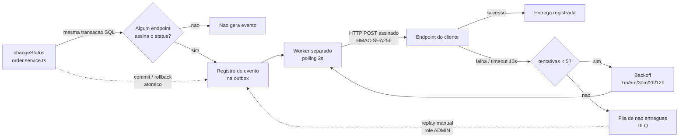

# RFC — Sistema de Webhooks de Notificação de Pedidos

## 1. Metadados

| Campo | Valor |
|-------|-------|
| **Autor** | Gabriele Rocha |
| **Status** | Em revisão |
| **Data** | 15 de julho de 2026 |
| **Altitude** | Arquitetura (COMO pretendemos resolver / O QUE está em aberto) |
| **Documentos relacionados** | PRD (o quê/porquê), FDD (detalhe de implementação), ADR-001..008 |

**Revisores / decisores** (participantes da reunião de design):

| Revisor | Papel |
|---------|-------|
| Larissa | Tech Lead (conduziu a reunião) |
| Marcos | Product Manager |
| Bruno | Engenheiro Pleno — time de Pedidos |
| Diego | Engenheiro Sênior — time de Plataforma |
| Sofia | Engenheira de Segurança |

---

## 2. Resumo executivo (TL;DR)

Três clientes B2B (Atlas Comercial, MaxDistribuição e Nova Cargo) pediram formalmente para serem notificados em tempo real quando o status de seus pedidos muda, substituindo o polling caro que hoje fazem contra `GET /orders` [09:00] Marcos. A proposta é entregar notificações **outbound** via webhooks HTTP usando o **padrão Outbox no MySQL**: dentro da mesma transação que altera o status do pedido, gravamos o evento (com payload em snapshot) numa tabela de outbox; um **worker em processo separado** faz polling a cada 2 segundos, assina cada envio com **HMAC-SHA256** (secret por endpoint) e entrega ao cliente com garantia **at-least-once** (dedup do lado do cliente via `X-Event-Id`). Falhas de entrega passam por **retry com backoff exponencial** (5 tentativas, 1m/5m/30m/2h/12h) e, esgotadas, vão para uma **Dead Letter Queue** com replay manual. A solução reutiliza ao máximo os padrões já existentes no projeto e foi consolidada em reunião de design [09:48]-[09:53].

---

## 3. Contexto e problema

Hoje os clientes B2B descobrem mudanças de status batendo periodicamente em `GET /orders`, o que torna a integração deles lenta e cara [09:00] Marcos. A Atlas sinalizou que pode migrar para o concorrente se não entregarmos até o fim do trimestre [09:00] Marcos. O requisito de negócio de "tempo real" foi definido como **latência de entrega abaixo de 10 segundos** [09:02] Marcos, e o escopo é estritamente **outbound** — nós notificamos o cliente; o cliente recebe, não envia [09:02] Marcos, [09:03] Sofia.

A restrição técnica central está no ponto de origem do evento: `changeStatus` em `src/modules/orders/order.service.ts` já roda uma transação pesada — atualiza `orders`, insere em `order_status_history` e movimenta estoque — dentro de `this.prisma.$transaction`. Disparar HTTP síncrono ali travaria a mudança de status de outros pedidos e criaria a pergunta insolúvel de "o que fazer se o cliente está offline" [09:04] Bruno. A arquitetura precisa **desacoplar** a geração do evento da entrega, sem perder consistência transacional.

---

## 4. Proposta técnica — visão geral

| ID | Elemento da proposta | ADR | Origem |
|----|----------------------|-----|--------|
| RFC-PROP-01 | **Outbox transacional no MySQL** — o evento é inserido na tabela de outbox dentro da mesma transação de `changeStatus`; commit → evento registrado, rollback → evento some junto | ADR-001 | [09:06] Diego |
| RFC-PROP-02 | **Snapshot do payload** na inserção (não só `order_id`), refletindo o estado do momento da mudança | ADR-007 | [09:52] Larissa/Diego/Bruno |
| RFC-PROP-03 | **Filtragem na inserção** — só grava o evento se algum endpoint do customer assina aquele status | ADR-008 | [09:33]-[09:34] |
| RFC-PROP-04 | **Worker em processo separado** (`src/worker.ts`) com **polling de 2s**, lendo pendentes em batch por `created_at` | ADR-002 | [09:09]-[09:11] Diego |
| RFC-PROP-05 | **Entrega HTTP assinada** com HMAC-SHA256, secret única por endpoint, headers de rastreio | ADR-004 | [09:20]-[09:22] Sofia |
| RFC-PROP-06 | **Retry com backoff exponencial** (5 tentativas: 1m/5m/30m/2h/12h) → **DLQ** com replay manual | ADR-003 | [09:15]-[09:18] Diego |
| RFC-PROP-07 | **At-least-once** com `X-Event-Id`; dedup delegado ao cliente | ADR-005 | [09:24]-[09:26] Diego |
| RFC-PROP-08 | **Reuso máximo** dos padrões do projeto (módulo, AppError, Pino, error middleware, Zod, auth) | ADR-006 | [09:27]-[09:30] |

### Fluxo em alto nível

O fluxo garante que a mudança de status e o registro do evento sejam **atômicos** — a inserção do evento faz parte da transação; se ela falhar, há rollback e o status não muda sem o evento sair [09:40] Bruno, [09:41] Diego — enquanto a **entrega** é assíncrona e resiliente. Detalhes de payload, headers, schema de tabelas, matriz de erros e assinaturas de função pertencem ao **FDD** e não são repetidos aqui.

---

## 5. Alternativas consideradas

| ID | Alternativa | Trade-off que motivou o descarte | Origem |
|----|-------------|----------------------------------|--------|
| RFC-ALT-01 | **Disparo síncrono** no order service | HTTP no meio da transação de status travaria a mudança de outros pedidos; cliente lento/offline forçaria rollback da mudança de status — inaceitável | [09:04] Bruno, [09:06] Diego |
| RFC-ALT-02 | **Redis Streams / fila externa** | Exigiria subir mais infraestrutura (Redis Cluster) — overengineering para um time pequeno; a outbox no MySQL existente já resolve | [09:07] Larissa/Diego |
| RFC-ALT-03 | **Trigger de banco** para reatividade | MySQL não tem NOTIFY/LISTEN como o Postgres; trigger só executa SQL, não notifica processo externo. Polling de 2s atende o "abaixo de 10s" sem gambiarra | [09:09] Diego |
| RFC-ALT-04 | **Retry indefinido** ou **3 tentativas** | Indefinido deixa evento pendurado para sempre se o cliente sumiu; 3 tentativas mata cedo demais (já houve indisponibilidade planejada de 2h). 5 tentativas cobre janela de ~12-24h | [09:15]-[09:16] Diego |
| RFC-ALT-05 | **Exactly-once delivery** | Exigiria coordenação dos dois lados, muito mais complexo. At-least-once + `X-Event-Id` é o padrão de mercado (Stripe, GitHub) e resolve 99% dos casos | [09:25] Diego |
| RFC-ALT-06 | **Secret global** da plataforma | Se uma secret vaza, vaza tudo. Secret única por endpoint isola o comprometimento (já houve cliente que vazou secret em log de aplicação) | [09:21] Sofia, [09:22] Diego |

---

## 6. Questões em aberto

| ID | Questão | Encaminhamento | Origem |
|----|---------|----------------|--------|
| RFC-OPEN-01 | **Rate limiting de saída** — se um customer tiver muitos pedidos mudando de status por minuto, bombardeamos o endpoint dele? | Observar em produção e decidir depois; implementar somente se virar problema | [09:38]-[09:39] Diego/Larissa |
| RFC-OPEN-02 | **Ordering global ao escalar** — com múltiplos workers em paralelo perde-se a ordem; qual estratégia (partição por `order_id` / lock pessimista)? | Não decidido, "problema do futuro". Hoje single-worker garante ordem por `order_id` e clientes não pediram ordering global | [09:13]-[09:14] |
| RFC-OPEN-03 | **Notificação ao cliente** sobre webhook com problema (ex.: e-mail após falhas seguidas) | Adiado para próxima fase, após medir o impacto | [09:37] Larissa/Marcos |
| RFC-OPEN-04 | **Endurecimento de roles** do CRUD de configuração (hoje qualquer role autenticada) | "Mais para frente"; por ora só o replay de DLQ exige role ADMIN | [09:37] Sofia |

---

## 7. Impacto e riscos (resumo)

O único ponto de acoplamento crítico com o código existente é `changeStatus` em `src/modules/orders/order.service.ts`: a inserção na outbox entra na transação já existente por meio de uma função pura que recebe o `tx` da transação atual, em vez de injetar o repository inteiro [09:41] Bruno/Diego (a assinatura da função é detalhada no FDD). Uma nova entry-point de processo (`src/worker.ts`) espelha `src/server.ts` e abre sua própria instância de `PrismaClient` — mesmo banco, mesma `DATABASE_URL`, processo separado [09:11][09:30]. O restante é aditivo (novo módulo em `src/modules/webhooks` e novos models no `prisma/schema.prisma`), reaproveitando error middleware, Pino e auth sem alterações.

Principais riscos (detalhamento e mitigações completas ficam no PRD/FDD):

| ID | Risco | Mitigação (resumo) | Origem |
|----|-------|--------------------|--------|
| RFC-RISK-01 | Cliente offline por período longo perde eventos | 5 tentativas em ~15h + DLQ + replay manual | [09:15]-[09:18] |
| RFC-RISK-02 | Secret vazada (ex.: log do cliente) | Secret por endpoint + rotação com grace de 24h | [09:21]-[09:22] |
| RFC-RISK-03 | Ordem fora de sequência ao escalar workers | Single-worker por ora; limitação documentada (ver RFC-OPEN-02) | [09:12]-[09:14] |
| RFC-RISK-04 | Bombardeio do cliente sem rate limit | Ponto em aberto: observar e implementar se virar problema (ver RFC-OPEN-01) | [09:38]-[09:39] |
| RFC-RISK-05 | Prazo apertado (Atlas migra ao concorrente) | 3 sprints planejadas, com ≥2 dias úteis reservados para a revisão de segurança antes do deploy | [09:45]-[09:46] |

---

## 8. Decisões relacionadas (ADRs)

- [ADR-001 — Padrão Outbox no MySQL com transação atômica](./adrs/ADR-001-outbox-no-mysql.md)
- [ADR-002 — Worker em processo separado com polling de 2s](./adrs/ADR-002-worker-processo-separado-polling.md)
- [ADR-003 — Retry com backoff exponencial e DLQ](./adrs/ADR-003-retry-backoff-e-dlq.md)
- [ADR-004 — Assinatura HMAC-SHA256 com secret por endpoint e rotação](./adrs/ADR-004-hmac-sha256-secret-por-endpoint.md)
- [ADR-005 — Entrega at-least-once com X-Event-Id](./adrs/ADR-005-at-least-once-x-event-id.md)
- [ADR-006 — Reuso dos padrões existentes do projeto](./adrs/ADR-006-reuso-padroes-existentes.md)
- [ADR-007 — Snapshot do payload na inserção da outbox](./adrs/ADR-007-snapshot-payload-na-outbox.md)
- [ADR-008 — Filtragem de eventos por assinatura na inserção da outbox](./adrs/ADR-008-filtragem-eventos-na-insercao.md)
